# Setting up Auth0

## Create Auth0 account

First, we'll need to create a new Auth0 account at https://auth0.com/signup. Their free-tier should be enough to get started with this project.

Upon creating the account, we'll be asked to create a "Tenant Domain" and select our region. These will be used to generate some of the values we'll need to provide in our environment.

We'll probably want to select "Personal" account type, but it is unclear what this actually affects.

## Universal login

Once signed up to Auth0, set up the "Login box" by clicking "Customize" from the Getting Started page.

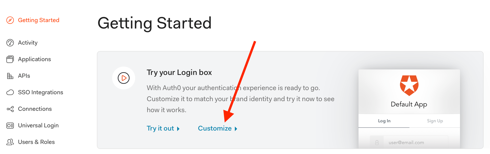

On the "Customize" page, select the "New" Universal Login page. Make sure to save the changes at the bottom of the page.

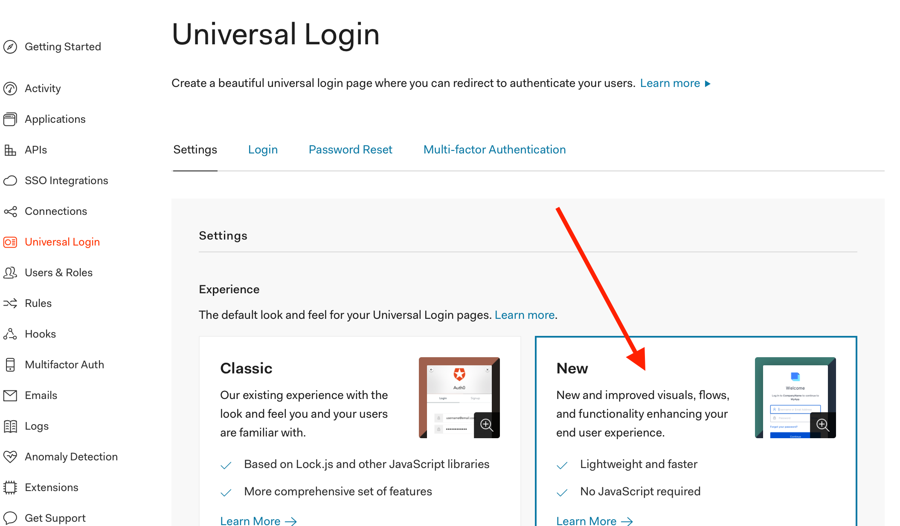

We can also set up the logo and colors, but that's not required to get this going.

## Create API

Next, we'll need to create an API that will be used for authentication.

Navigate to "APIs" from the sidebar, then use the "Create API" button to setup a new API.

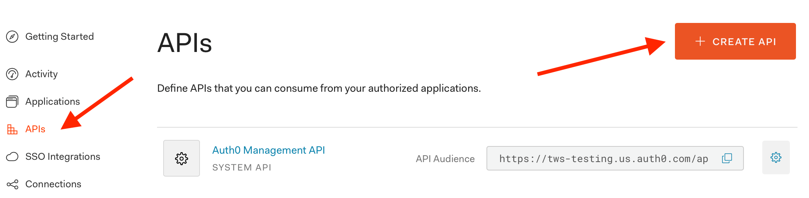

We'll need to provide a `Name`, URL `Identifier` (this will be used as our `audience` when setting up the server) and leave the `Signing Algorithm` as `RS256`.

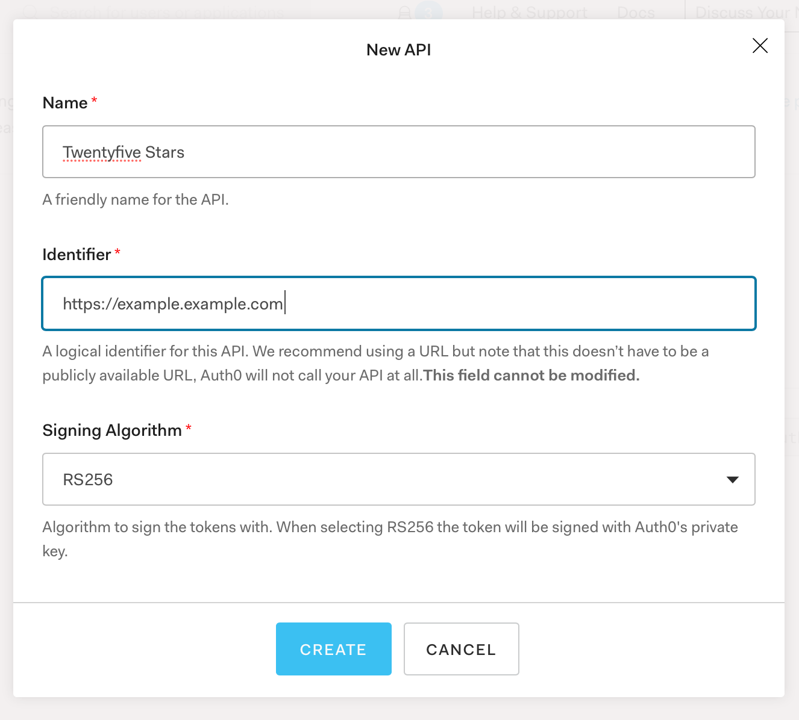

Once this API has been created, we need to enable RBAC in the "Settings" pane. It is near the bottom.

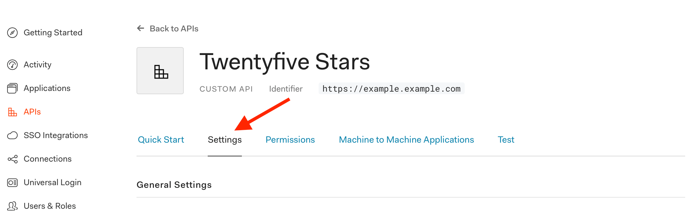

Turn on the "Enable RBAC" and "Add Permissions in the Access Token" toggles.

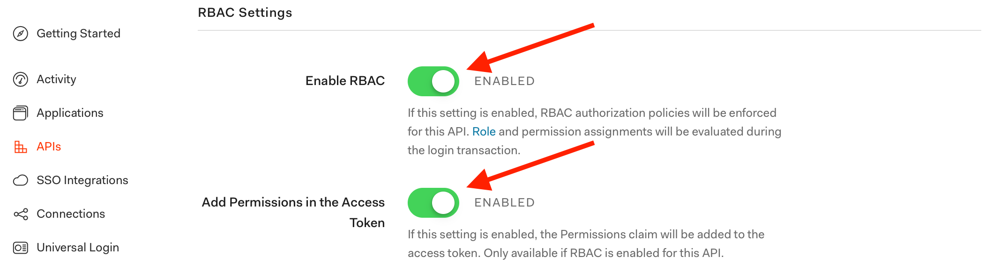

We are also going to set up our initial permissions in the "Permissions" pane. Using the input boxes, add two permissions to the API:

1. `create:waves` (description: "Add wave data with GraphQL mutations")
2. `create:battle_cards` (description: "Add battle card data with GraphQL mutations")

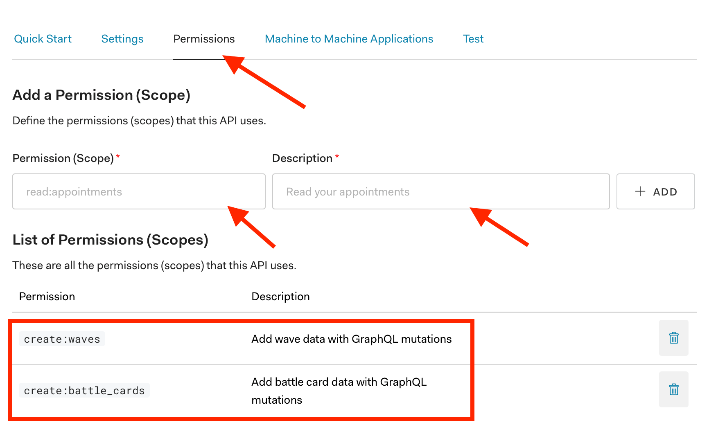

Remember to save all these changes.

## Application

When the API was created, a "Test Application" was automatically generated that we can use.

Navigate to "Applications" from the sidebar, then select the "Machine to Machine" test application that was generated.

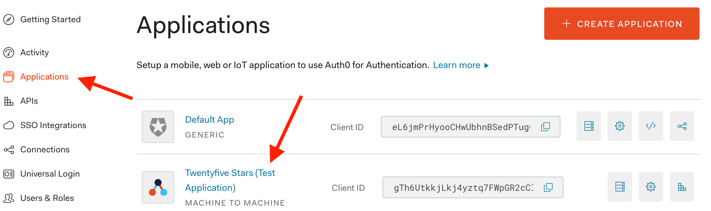

In the "Settings" pane, we'll need to set the "Allowed Callback URLs" to `http://localhost:3000/login_success` and the "Allowed Logout URLs" to `http://localhost:3000/`

Before saving, we need to change something in "Advanced Settings", so click "Show Advanced Settings" above the Save button.

We'll need to adjust the grants available to our API in the "Grant Types" pane. Enable the "Authorization Code" grant.

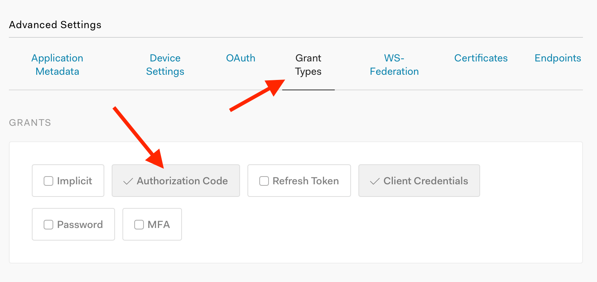

Now we can save the changes!

## Environment variables

We'll need to grab a bunch of environment variables from the "Test Application". These will need to be set in our `.env` file.

__Note:__ Forgive me for no screenshots of these, it's easier than blurring values.

1. `AUTH0_CLIENT_ID` is the "Client ID" value from the "Basic Information" section
2. `AUTH0_CLIENT_SECRET` is the "Client Secret" value from the "Basic Information" section
3. `AUTH0_BASE_URL` is the "Domain" value from the "Basic Information" section, but remember to add `https://` to make it a valid URL

To get the "Audience" value we need, return to our API page.

1. `AUTH0_AUDIENCE` is the "Identifier" from the "General Settings" section

The other two values must match the URLs we added in the "Allowed URLs" inputs. If using the defaults, we can use:

1. `AUTH0_LOGIN_REDIRECT_URL=http://localhost:3000/login_success`
2. `AUTH0_LOGOUT_RETURN_URL=http://localhost:3000/`

## Creating a user

Once the server is running, we can create a new user by navigating to `localhost:3000/login`, which will redirect to the Auth0 login form. Here, we can use the "Sign Up" link at the bottom to create a new user account for the application.

## Roles and permissions

After the user is created, we can add roles and permissions to it. We need to navigate to "Users & Roles" -> "Roles" using the sidebar.

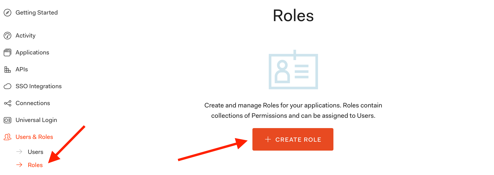

Here, we can create a new role. Something like "Create Data" with the description "User that adds data through GraphQL mutations", but we can use whatever name/description.

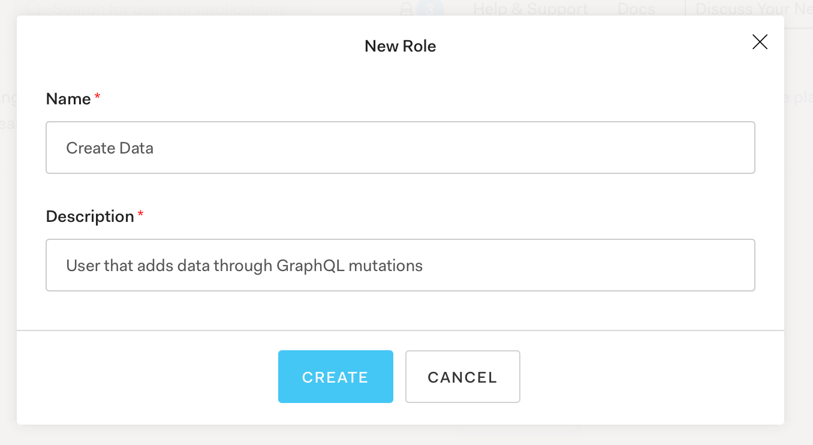

In the "Permissions" pane, we can add new permissions for this role.

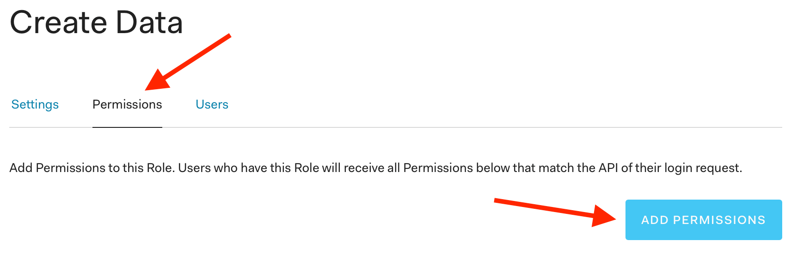

Let's add both permissions (`create:waves` and `create:battle_cards`) we added for our API.

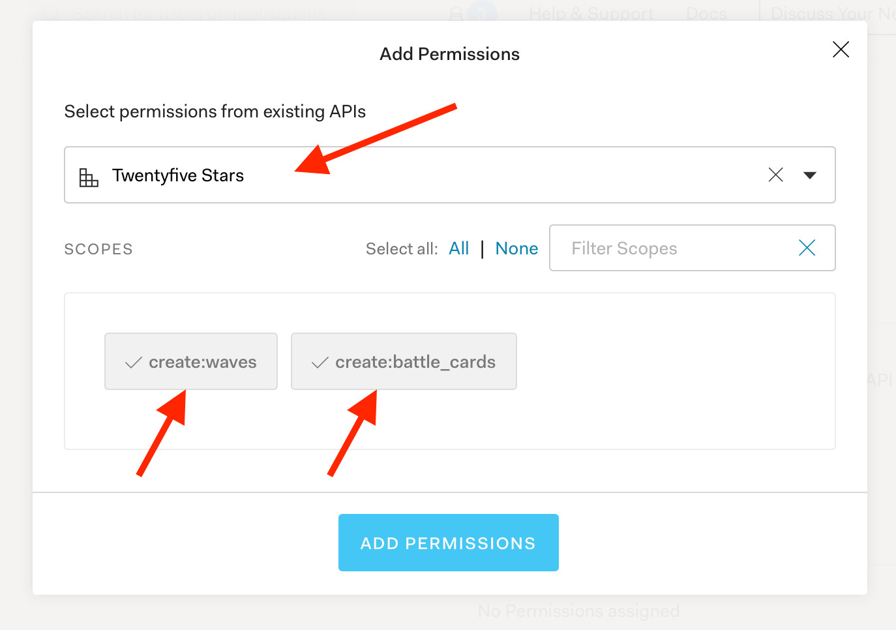

Finally, we can add our user to the role. Find "Add Users" in the "Users" pane.

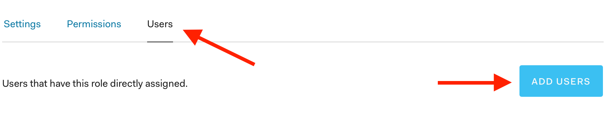

We can search for the user we created during signup.

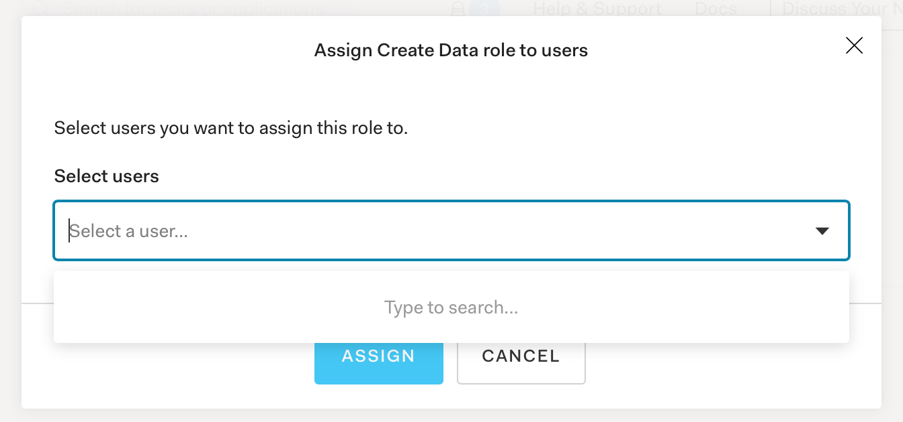

## Logout & back in

Since JWTs last a long time and our original one didn't have permissions assigned, we actually need to logout of the app by visiting `localhost:3000/logout`.

Then, we can the login again by visiting `localhost:3000/login`. Once redirected to the GraphiQL interface, we should be presented with a new pane. If we look closely, there should be an "HTTP Header" populated with our JWT.

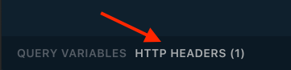

Using that header, we should be able to issue mutations against the server!
